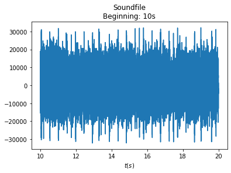
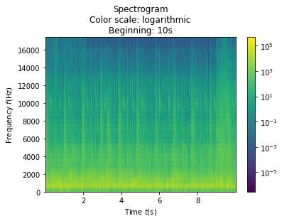
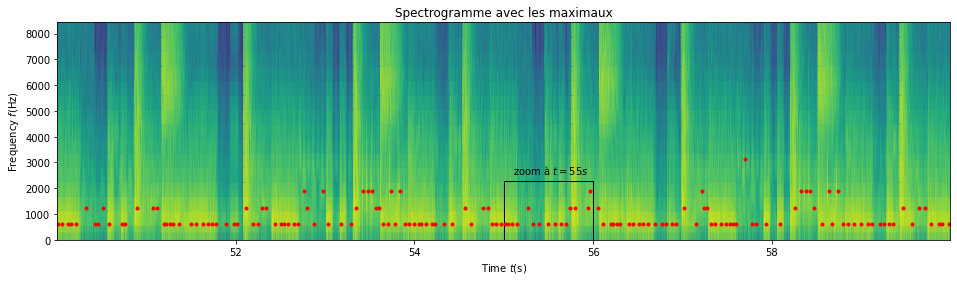
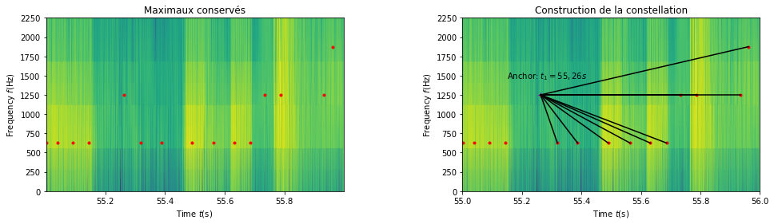
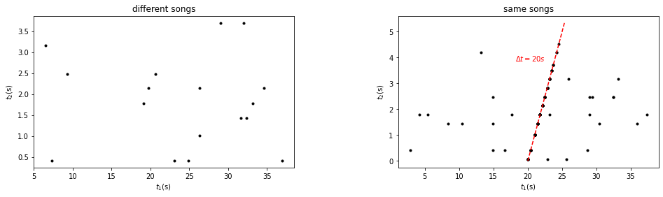
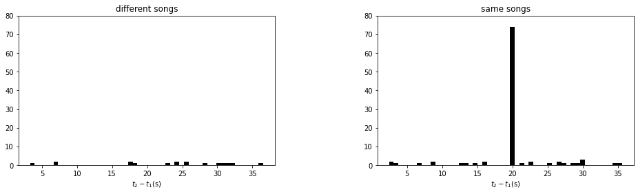
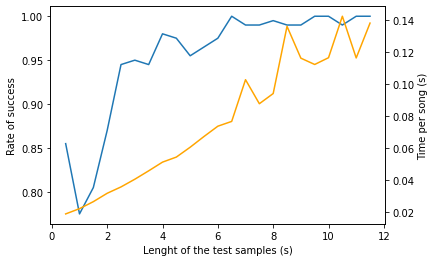

README.md
========================================

# Compte-rendu du projet - Traitement du signal

Nous avons choisi de partir de zéro pour le fichier algorithme.py
(renomé main.py) car cela me donne un peu plus de libertés pour
structurer le code.

``` python
import main
import matplotlib.pyplot as plt
import numpy as np
from alive_progress import alive_bar
import performance_test
```

## Étape 1

On créer une classe `Encoding` qui permet d\'encoder un morceau de
musique et de créer sa signature. Cette classe permet des
fonctionnalités de visualisation de base, sur une plage temporelle que
l\'on peut préciser:


``` python
SoundFile = main.Encoding('samples\Frisk - Au.Ra.wav')
SoundFile.display((10,20))
SoundFile.display_spectrogram((10,20), max_freq=20000)
```







On affiche ici seulement les fréquences audibles (jusqu\'à 20kHz) On se
demande comment est réparti l\'énergie du signal sur le spectrogramme.
Celle-ci est proportionnelle au carré des coefficients de Fourier.
Lorsque l\'on utilise la fonction `scipy.signal.spectrogram`, on obtient
le carré des coefficients de Fourier dans une matrice (dont les
dimensions dépendent de la longueur du morceau et des paramètres
`nperseg` et `noverlap`.)\
Prenons un échantillons de musique de 10s, et regardons combien de
coefficient permettent de caractériser 90% de l\'énergie:

``` python
t, f, spec = SoundFile.spectrogram((10,20), max_freq=20000)
total_energy = spec.sum()
separator = 0
#On recherche les coefficients qui contiennent 90% de l'énergie à eux seuls:
while ((spec > separator)*spec).sum() > 0.9*total_energy:
    separator += 10**(-6)*total_energy

proportion = ((spec > separator)*spec).sum()/total_energy
N = (spec > separator).sum()
short_prop = "{0:.2f}".format(proportion*100)
coef_prop = "{0:.2f}".format(100*N/(spec>0).sum())

print(f"Sur cet exemple, {N} coefficients permettent de caractériser {short_prop}% de l'énergie du signal.")
print(f"Cela correspond à seulement {coef_prop}% des coefficients totaux!")
```

On peut voir sur cet exemple que **moins de 10% des coefficients** du
spectrogramme suffisent à caractériser **90% de l\'énergie!**

Il est donc possible de caractériser le signal via une signature de
données bien plus légère que les lourds échantillons de spectrogrammes.

## Étape 2: Constellations

Pour faire les *constellations*, on utilise la fonction
`peak_local_max`. Il faut cependant choisir la distance minimale qui
doit séparer deux pics. Le spectrogramme, avec les parmètres choisis,
utilise aux alentours de 25 000 échantillons par seconde. On souhaite
garder seulement les 1% de coefficients qui contiennent le plus
d\'information (d\'énergie), soit environ 250 échantillons par seconde.
On constate que l\'algorithme final est efficace avec encore bien moins
de coefficients.

Dans le code, la variable `MIN_DISTANCE` est **une variable à
optimiser**. Cette variable détermine la quantité d\'information que
l\'on va conserver pour caractériser le morceau. En testant plusieurs
valeurs, on constate que fixer `MIN_DISTANCE` à 130 est un bon choix.
Lorsque l\'on regarde le nombre de points dans la constellation, on
constate que **seulement 0,01% de l\'information est conservée**!

``` python
import os
import matplotlib.pyplot as plt
from skimage.feature import peak_local_max

folder = './samples/'

import os
audiofiles = os.listdir(folder)
audiofiles = [item for item in audiofiles if item[-4:] =='.wav']

c=1
for file in audiofiles:
    sf = main.Encoding(folder+file)
    t, f, spec = sf.spectrogram((20,30), max_freq = 20000)
    pk = peak_local_max(spec, min_distance=130, exclude_border=False)
    rate = "{0:.2f}".format(100*len(pk)/spec.size)
    print(f"Échantillon n°{c}: on garde {rate}% de l'information")
    c+=1
```


    Échantillon n°1: on garde 0.01% de l'information
    Échantillon n°2: on garde 0.01% de l'information
    Échantillon n°3: on garde 0.01% de l'information
    Échantillon n°4: on garde 0.01% de l'information
    Échantillon n°5: on garde 0.01% de l'information
    Échantillon n°6: on garde 0.01% de l'information
    Échantillon n°7: on garde 0.01% de l'information
    Échantillon n°8: on garde 0.01% de l'information
    Échantillon n°9: on garde 0.01% de l'information

## Étape 3: Signature

Nous allons maintenant procéder à l\'éllaboration la signature. On
introduit **deux nouvaux paramètres globaux à optimiser**:

-   `DELTA_T`
-   `DELTA_F`

Ainsi, les cibles doivent se trouver à moins de `DELTA_T` secondes de
leur ancre, et leur fréquence ne doit pas différer de plus de `DELTA_F`
Hz. Ces variables déterminent la façon dont on associes les *ancres*
avec leurs *cibles*. La constellation est la donnée qui rassemble sous
forme de liste des couples ancre-cible. Ces derniers sont codés sous
forme de dictionnaires: `{'t': t1, 'hash':(t2-t1,f1,f2)}` avec:

-   t1 la position en temps de l\'ancre
-   t2 la position en temps de la cible
-   f1 et f2 les positions respectives en fréquence de l\'ancre et de la
    cible

On remarque que **l\'attribut `'hash'` est invariant par translation**
dans le temps.

Ces constellations sont des données **peu volumineuses** et
**suffisantes pour caractériser** un morceau. Après avoir implémenter la
méthode `Encoding.process()`, on peut alors former les constellations
des différents morceaux de test situés dans le fichier *\\samples* à
l\'aide du fichier `database.py`.

Voici une représentation des maximaux (en rouge) qui sont conservés pour
construire la constellation (sur un échantillon de 1s):

``` python
performance_test.Examples().constellation_example()
```





## Étape 4: Encodage des moreceaux

On execute le programme `database.py` afin de former les signatures des
9 morceaux test puis de les sérialiser.

## Étape 5: Comparaison de la signature de deux extraits

On souhaite comparer la signature d\'un extrait musical avec celle d\'un
morceau complet pour voir si les deux correspondent. Pour cela, on va
comparer les dictionnaires `{'t': t1, 'hash':(t2-t1,f1,f2)}` des
signatures entre eutre eux, et retenir ceux qui ont leurs `hash` égaux
(on accepte une erreur `EPSILON` pour `t2-t1`).\
On forme alors un nuage de points `(t1,t1')` qui rassemble la date des
ancres pour lesquels il y a eu correspondance (on notera par la suite
`(t1,t2)`).

``` python
performance_test.Examples().comparison('scatterplot')
```



On peut voir que lorsque deux extraits sont issus du même morceaux, les
points s\'aligne sur une droite d\'équation $y=x+b$ où $b$ est un
déphasage temporel.

## Étape 6: histogramme

On représente sur un histogramme les quantités `t1-t2` pour le même
exemple que précédemment.

``` python
performance_test.Examples().comparison('histogram')
```



``` python
performance_test.Examples().comparison('same_song')
```

On cas de correspondance des morceaux, on pic se démarque des autres.
Lorsque l\'on compare un extrait au morceau entier, on obtient:

## Étape 7: Critère de décision

On choisi comme critère que le pic le plus grand de l\'histogramme doit
être 10 fois plus grand que le deuxième plus grand pic, ce qui s\'avère
largement vérifié pour cet exemple. Il ne faut cependant pas que le
critère soit trop sévère: en effet, si l\'échantillon test correspond au
refrain d\'un morceau, on peut alors observer des pics secondaires très
importants qui correspondent au refrain qui est joué plusieurs fois
quasiment à l\'identique\...

## Étape 8: Étude de la performance

``` python
test = performance_test.Test(samples_lenght=10, N=100)
test.run(display=True);
```


    Test succeeded
    Number of tests: 100
    Number of success: 100
    Success rate: 1.0
    Processing time: 0.11s


On met en place un algorithme qui permet de tester l\'algorithme N fois
sur des échantillons de longueurs choisies. La fonction donne alors le
taux de succès ainsi que le temps moyen que met l\'algorithme à donner
sa réponse. On se propose d\'étudier également le temps moyen que met
l\'algorithme pour donner une réponse.

**Attention**: La cellule qui suit nécessite plusieurs minutes de
calcul.

``` python
performance_test.Test().time_success()
```





On peut voir que l\'algorithme a un très bon taux de succès. Celui-ci
est meilleur si les échantillons de test sont longs, mais cela ralonge
le temps que l\'algorithme met pour nous donner une réponse.


Organisation des données
------------------------
|
|--samples/          *# Répertoire contenant les fichiers musicaux*


Fichiers source
----------------

Le fichier *algorithm.py* contient deux classes:
- la classe Encoding permet d'extraire l'empreinte des fichiers musicaux et/ou 
  des extraits musicaux
- la classe Matching permet de comparer deux empreintes

*database.py* est un script Python permettant de calculer les 
signatures des morceaux de la base de donnée et de générer un fichier 
(extension .pickle) regroupant les caractéristiques de ces morceaux.

Le fichier *demo.py* permet enfin de sélectionner aléatoirement un extrait dans 
la base de morceaux et cherche ensuite à quel morceau cet extrait correspond.


Base de donnée
----------------

Les morceaux de la base de donnée se trouvent dans le dossier 'samples'. 
Tous les morceaux sont enregistrés au format .wav à une fréquence de 55 kHz.


Librairies nécessaires
----------------------

- numpy
- scipy
- scikit-image


